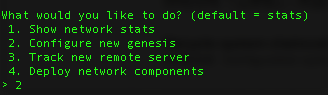

# Proof of Work(PoW)

## Environment
* Used for `Node >= 7.0.0`
* OpenStack instances(Core4 8G)

## Quick start

### Update apt
```
apt-get update
```
### Install ethereum
```
apt-get install software-properties-common -y
add-apt-repository -y ppa:ethereum/ethereum
apt-get update
apt-get install ethereum -y
```

### Initialize genesis.json

#### use puppeth create genesis.json

Specify a network name


Configure new genesis(enter 2)



Select consensus(enter 1)


pre-funded balance to account(direct enter)


Specify network ID


Manage existing genesis(enter 2)


Export genesis configuration(enter 2)


Specify genesis file name


Use "control + C" leave it.

Now copy this genesis.json to all Ethereum node.

### Use geth command initialize Ethereum with genesis.json
```
geth --datadir .ethereum/ init genesis.json 
```


### Run Ethereum Node
```
geth --nodiscover --networkid 777 --datadir .ethereum/ --rpc --rpcapi eth,net,web3 --rpcaddr=0.0.0.0 console
```
Create a account and unlock it.


Start miner


### Dashboard
```
git clone https://github.com/cubedro/eth-netstats
cd eth-netstats/
npm install 
npm install -g grunt-cli
grunt
screen
WS_SECRET=101 npm start
```

### get Ethereum node intelligence
```
git clone https://github.com/cubedro/eth-net-intelligence-api
cd eth-net-intelligence-api/
npm install
npm install pm2 -g
vim app.json
```
Fix RPC_HOST, INSTANCE_NAME, WS_SERVER and WS_SECRET
```
[
  {
    "name"              : "node-app",
    "script"            : "app.js",
    "log_date_format"   : "YYYY-MM-DD HH:mm Z",
    "merge_logs"        : false,
    "watch"             : false,
    "max_restarts"      : 10,
    "exec_interpreter"  : "node",
    "exec_mode"         : "fork_mode",
    "env":
    {
      "NODE_ENV"        : "production",
      "RPC_HOST"        : "10.20.0.208",
      "RPC_PORT"        : "8545",
      "LISTENING_PORT"  : "30303",
      "INSTANCE_NAME"   : "node-1",
      "CONTACT_DETAILS" : "",
      "WS_SERVER"       : "http://10.20.0.208:3000",
      "WS_SECRET"       : "101",
      "VERBOSITY"       : 2
    }
  }
]
```
Start getting Ethereum node intelligence 
```
pm2 start app.json
```

use http://10.20.0.208:3000 look Dashboard.